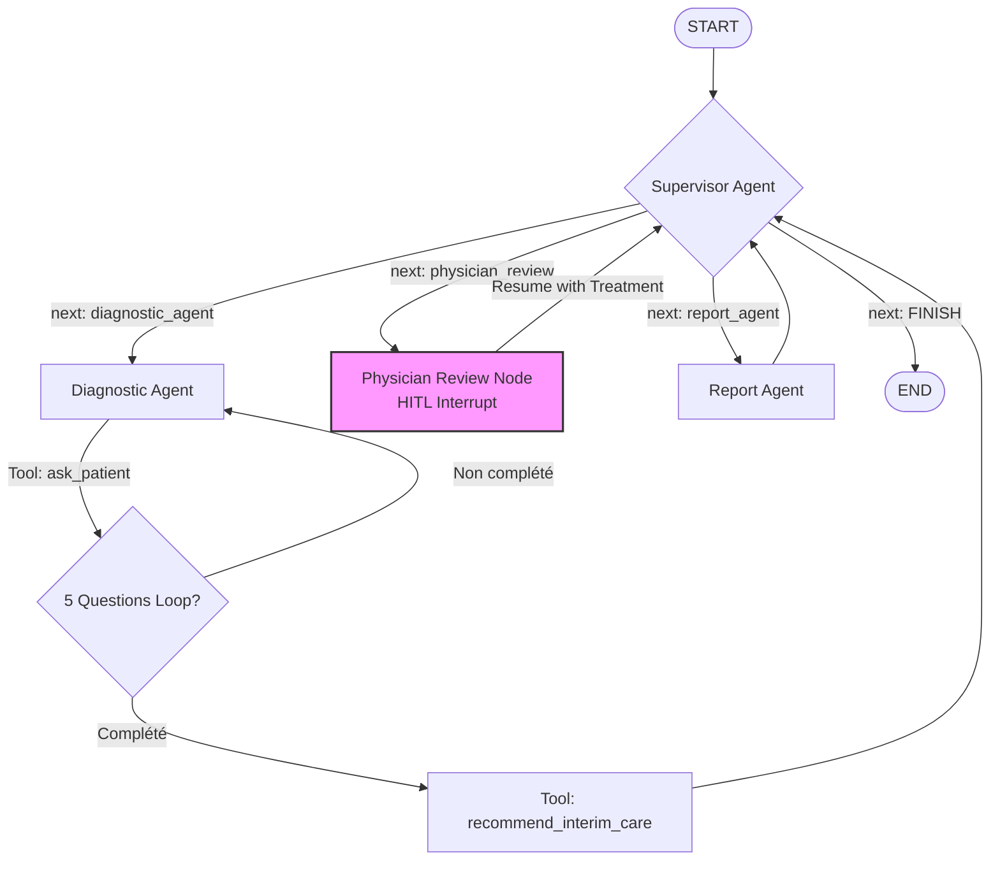

# Diagnostic Médical — Système Multi-Agents avec LangGraph

**Projet :** Système multi-agents médical pour l'orientation clinique
**Cadre Pédagogique :** Université (S8) — Agentic AI / Pr. Mohamed YOUSSFI
**Technologies Cibles :** LangGraph, LangChain, FastAPI, Model Context Protocol (MCP), React/Angular/Flutter/Streamlit

---

> [!WARNING]
> **Cadre Pédagogique et Éthique Obligatoire :**
> - Ce projet est un exercice académique et le système **ne doit pas** être présenté comme un dispositif médical ni fournir de diagnostic définitif.
> - Les termes recommandés à utiliser sont : **orientation clinique préliminaire**, **synthèse clinique**, et **recommandation intermédiaire**.
> - Le rapport final doit obligatoirement mentionner la clause de non-responsabilité suivante :  
>   *« Ce système ne remplace pas une consultation médicale. »*

---

## 📖 Table des Matières
1. [Contexte & Objectifs](#-contexte--objectifs)
2. [Architecture du Système](#-architecture-du-système)
3. [Structure de l'État Partagé (State)](#-structure-de-létat-partagé-state)
4. [Intégration du Protocole MCP](#-intégration-du-protocole-mcp)
5. [Spécifications de l'API FastAPI](#-spécifications-de-lapi-fastapi)
6. [Interface Utilisateur (Frontend)](#-interface-utilisateur-frontend)
7. [Feuille de Route (5 Sprints de Développement)](#-feuille-de-route-5-sprints-de-développement)
8. [Guide d'Installation et Exécution](#-guide-dinstallation-et-exécution)

---

## 🎯 Contexte & Objectifs

Le but de ce projet est de concevoir et développer une application multi-agents basée sur **LangGraph** simulant un workflow d'orientation clinique. Le système recueille les informations du patient, produit une synthèse clinique préliminaire enrichie par des guidelines via MCP, intègre une validation humaine (Human-in-the-Loop) par un médecin traitant, puis génère un rapport final structuré.

### Objectifs d'apprentissage
- **Modélisation multi-agents** et contrôle de flux avec LangGraph.
- **Gestion de l'état partagé** (State) entre agents avec LangGraph.
- **Human-in-the-Loop** : mise en place d'une interruption pour la validation médicale.
- **MCP (Model Context Protocol)** : création et appel d'un outil externe de recommandations.
- **API Rest** : exposition du graphe sous forme d'API structurée avec FastAPI.
- **Interface UI** : développement d'un frontend réactif connecté à l'API.
- **Studio de débogage** : visualisation et test dans LangGraph Studio.

---

## 🏗️ Architecture du Système

### Flux de Contrôle (Workflow Minimal)



### Agents Obligatoires
1. **Supervisor** : Orchestre le workflow et prend la décision de la prochaine étape à exécuter en fonction de l'état.
2. **Diagnostic Agent** : Pose exactement 5 questions de suivi générées de manière 100% dynamique par le LLM (s'adaptant à la plainte et au profil du patient), réalise une pré-analyse et produit une synthèse clinique préliminaire.
3. **Physician Review** : Étape Human-in-the-Loop (HITL) représentant le médecin traitant. Elle interrompt le graphe pour recueillir l'avis médical.
4. **Report Agent** : Génère le rapport final structuré incluant les avertissements éthiques.

---

## 💾 Structure de l'État Partagé (State)

L'état partagé entre les agents est modélisé sous la structure suivante (`MedicalState`) :

```python
from typing import Annotated, List
from typing_extensions import TypedDict, Literal
from langgraph.graph.message import add_messages

class MedicalState(TypedDict, total=False):
    # Identifiants et informations patient
    workflow_id: str
    patient_name: str
    patient_age: int
    patient_gender: str
    chief_complaint: str  # Plainte initiale
    
    # Historique conversationnel
    messages: Annotated[list, add_messages]
    
    # Indicateurs de progression
    next: Literal["diagnostic_agent", "physician_review", "report_agent", "FINISH"]
    question_count: int
    question_answers: List[dict]  # Liste des Q/A du patient
    
    # Résultats des étapes
    diagnostic_summary: str      # Synthèse clinique préliminaire
    interim_care: str            # Recommandations d'urgence / temporaires
    physician_review: str        # Traitement / Conduite à tenir saisie par le médecin
    final_report: str            # Rapport final complet structuré
    status: str                  # Statut du workflow (running, waiting_patient, waiting_physician, completed)
```

---

## 🔌 Intégration du Protocole MCP, Recherche RAG & Sécurité

L'utilisation du **Model Context Protocol (MCP)** est intégrée pour fournir aux agents une recherche médicale dynamique externe (RAG) et une évaluation locale de sécurité :
- **mcp_server/server.py** : Un serveur MCP qui expose deux outils :
  1. **`web_medical_search(query: str) -> str`** : Outil de RAG dynamique interrogeant l'API Tavily pour obtenir des résumés de guidelines médicales récentes et des sources réelles. En cas d'échec ou d'absence de clé, il bascule sur un simulateur de recherche clinique local de haute qualité (HAS, CDC, Mayo Clinic).
  2. **`red_flag_checker(fever, breathing_difficulty, chest_pain) -> str`** : Outil local déterminant le niveau de gravité d'un dossier (`URGENT`, `MODERATE`, `LOW`) pour alerter le LLM et imposer des consignes de sécurité (ex. appeler le 15/SAMU en cas de douleurs thoraciques).
- Le **Diagnostic Agent** établit une connexion stdio asynchrone avec ce serveur pour collecter ces données et guider la génération de la synthèse et des recommandations intermédiaires.

---

## ⚡ Spécifications de l'API FastAPI

Le backend expose des endpoints REST pour interagir de façon asynchrone avec le graphe et gérer les états d'interruption :

| Méthode | Endpoint | Description |
| :--- | :--- | :--- |
| `POST` | `/consultation/start` | Initialise la session avec les informations du patient (`name`, `age`, `gender`, `chief_complaint`). |
| `POST` | `/consultation/{workflow_id}/answer` | Enregistre une réponse du patient à la question courante et avance le graphe. |
| `POST` | `/consultation/{workflow_id}/physician-review` | Permet au médecin de soumettre ses instructions cliniques (reprise du HITL). |
| `GET` | `/consultation/{workflow_id}` | Récupère l'état actuel de la consultation (questions en cours, statut, etc.). |
| `GET` | `/consultation/{workflow_id}/report` | Récupère le rapport final généré pour la consultation spécifiée. |

---

## 💻 Interface Utilisateur (Frontend)

L'interface doit permettre de gérer la consultation à travers **4 écrans minimaux** :

1. **Écran 1 — Admission & Cas Initial** : Saisie du nom, de l'âge, du genre et de la plainte initiale du patient.
2. **Écran 2 — Questions/Réponses Patient** : Affichage dynamique des 5 questions du Diagnostic Agent successives avec champ de saisie pour le patient.
3. **Écran 3 — Espace Médecin (HITL)** : Affichage de la synthèse clinique et de la recommandation intermédiaire. Formulaire de saisie pour le médecin traitant (traitement ou conduite à tenir) afin de valider et relancer le flux.
4. **Écran 4 — Rapport Final** : Affichage du rapport structuré généré par le `Report Agent` avec les clauses éthiques requises.

---

## 🚀 Feuille de Route (5 Sprints de Développement)

Ce projet est planifié en **5 Sprints** progressifs, chacun débouchant sur un livrable testable :

### 🏃 Sprint 1 : Cœur du système (LangGraph & Supervisor)
* **Objectif :** Obtenir un squelette de workflow fonctionnel dans le terminal.
* **Tâches :**
  - Configurer `MedicalState`.
  - Implémenter les nœuds de base : `Supervisor`, `Diagnostic Agent`, `Report Agent`.
  - Relier le graphe minimal : `START -> Supervisor -> DiagnosticAgent -> ReportAgent -> END`.
* **Livrable :** Script fonctionnel `python app/graph.py` qui simule le flux complet dans la console.

### 🏃 Sprint 2 : Agent conversationnel & LLM (OpenAI/LangChain)
* **Objectif :** Mettre en place la boucle interactive de 5 questions patient.
* **Tâches :**
  - Intégrer `ChatOpenAI` ou LLM compatible dans le `Diagnostic Agent`.
  - Implémenter l'outil `ask_patient` et le mécanisme de comptage des questions.
  - Implémenter la génération automatique de la synthèse clinique préliminaire et de l'interim care à partir des réponses récoltées.
* **Livrable :** Scénario de terminal complet : plainte initiale -> 5 questions -> synthèse clinique.

### 🏃 Sprint 3 : Human-in-the-Loop (HITL)
* **Objectif :** Mettre en place l'interruption pour le médecin traitant.
* **Tâches :**
  - Ajouter le nœud `Physician Review`.
  - Configurer l'interruption via `interrupt()` dans LangGraph lors de la transition vers le médecin.
  - Permettre la reprise du graphe après l'envoi de la décision du médecin.
* **Livrable :** Flux LangGraph complet avec pause éthique et reprise.

### 🏃 Sprint 4 : API FastAPI & Persistance SQLite
* **Objectif :** Rendre le système accessible via une API Rest persistée.
* **Tâches :**
  - Créer la base de données SQLite et la table `workflow` pour stocker l'état des consultations.
  - Implémenter les endpoints FastAPI (`/consultation/start`, `/answer`, `/physician-review`, etc.).
  - Documenter l'API via Swagger UI (`/docs`).
* **Livrable :** API FastAPI fonctionnelle et entièrement testable via Swagger ou Postman.

### 🏃 Sprint 5 : Frontend, MCP et Finalisation
* **Objectif :** Intégrer l'interface utilisateur, le protocole MCP et peaufiner les livrables.
* **Tâches :**
  - Connecter le frontend (React, Angular, Flutter, ou Streamlit) aux API FastAPI.
  - Développer et lancer le serveur MCP (`mcp_server/server.py`) fournissant les guidelines.
  - Brancher l'outil MCP sur le Diagnostic Agent.
  - Préparer la configuration Docker Compose pour lancer backend, frontend et mcp_server conjointement.
  - Effectuer les tests et démonstrations dans LangGraph Studio.
* **Livrable :** Application complète, conteneurisée, prête pour démonstration.

---

## 🛠️ Guide d'Installation et Exécution

### Prérequis
- Docker et Docker Compose
- Clé d'API pour au moins l'un des fournisseurs LLM suivants dans `backend/.env` :
  - `OPENAI_API_KEY` (OpenAI native)
  - `OPENROUTER_API_KEY` (Mistral/Llama/etc.)
  - `GEMINI_API_KEY` (Gemini API)
- Clé d'API Tavily pour la recherche RAG (optionnel) :
  - `TAVILY_API_KEY` (Si manquante, le serveur MCP bascule sur un simulateur de recherche médicale locale)

### Configuration des Variables d'Environnement
Créez un fichier `.env` dans le dossier `backend/` en vous basant sur [backend/.env.example](file:///c:/Users/riyad/OneDrive/Desktop/UNIVERSITE%20S8/AGENTIC%20AI/IA_medical_assistant/backend/.env.example) :
```ini
OPENAI_API_KEY=your_openai_api_key
OPENROUTER_API_KEY=your_openrouter_api_key
GEMINI_API_KEY=your_gemini_api_key
TAVILY_API_KEY=your_tavily_api_key
LLM_MODEL=gpt-4o-mini
```

---

### Lancement via Docker Compose (Recommandé)
Pour compiler et démarrer l'ensemble des services (FastAPI Backend, Next.js Frontend, SQLite DB et serveur MCP) :

```bash
docker-compose up --build
```

Une fois les conteneurs démarrés :
- 🖥️ **Interface Utilisateur Next.js** : [http://localhost:3002](http://localhost:3002)
- ⚡ **Documentation API FastAPI Swagger** : [http://localhost:8080/docs](http://localhost:8080/docs)
- 💾 **Persistance SQLite** : Base de données créée et montée localement dans `backend/data/medical.db`.

---

### Exécution Locale Manuelle (Sans Docker)

1. **Configurer et lancer le Backend (FastAPI + Graphe)** :
   ```bash
   cd backend
   python -m venv venv
   source venv/bin/activate # ou venv\Scripts\activate sous Windows
   pip install -r requirements.txt
   uvicorn main:app --reload --port 8080
   ```

2. **Lancer le Frontend Next.js** :
   ```bash
   cd frontend
   pnpm install # ou npm install
   pnpm dev # ou npm run dev (Le frontend démarre sur http://localhost:3000)
   ```

3. **Exécuter les Tests d'Intégration** :
   Pour valider le bon fonctionnement du graphe, des outils MCP et de l'API REST :
   ```bash
   python backend/test_api.py
   ```
